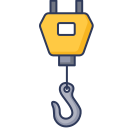

<div id="top"></div>
<!--
*** Thanks for checking out the Best-README-Template. If you have a suggestion
*** that would make this better, please fork the repo and create a pull request
*** or simply open an issue with the tag "enhancement".
*** Don't forget to give the project a star!
*** Thanks again! Now go create something AMAZING! :D
-->

<!-- PROJECT SHIELDS -->
<!--
*** I'm using markdown "reference style" links for readability.
*** Reference links are enclosed in brackets [ ] instead of parentheses ( ).
*** See the bottom of this document for the declaration of the reference variables
*** for contributors-url, forks-url, etc. This is an optional, concise syntax you may use.
*** https://www.markdownguide.org/basic-syntax/#reference-style-links
-->

[![Contributors][contributors-shield]][contributors-url]
[![Forks][forks-shield]][forks-url]
[![Stargazers][stars-shield]][stars-url]
[![Issues][issues-shield]][issues-url]
[![MIT License][license-shield]][license-url]
[![LinkedIn][linkedin-shield]][linkedin-url]

<!-- PROJECT LOGO -->
<br />
<div align="center">
  <a href="https://github.com/thytanium/react-hooks">
    
  </a>

<h1 align="center">@thytanium/react-hooks</h1>

  <p align="center">
    Useful React hooks
    <br />
    <br />
    <a href="https://github.com/thytanium/react-hooks/issues">Report Bug</a>
    ·
    <a href="https://github.com/thytanium/react-hooks/issues">Request Feature</a>
  </p>
</div>

<!-- TABLE OF CONTENTS -->
<details>
  <summary>Table of Contents</summary>
  <ol>
    <li>
      <a href="#about-the-project">About The Project</a>
      <ul>
        <li><a href="#built-with">Built With</a></li>
      </ul>
    </li>
    <li>
      <a href="#getting-started">Getting Started</a>
      <ul>
        <li><a href="#prerequisites">Prerequisites</a></li>
        <li><a href="#installation">Installation</a></li>
      </ul>
    </li>
    <li><a href="#usage">Usage</a></li>
    <li><a href="#roadmap">Roadmap</a></li>
    <li><a href="#contributing">Contributing</a></li>
    <li><a href="#license">License</a></li>
    <li><a href="#contact">Contact</a></li>
    <li><a href="#acknowledgments">Acknowledgments</a></li>
  </ol>
</details>

<!-- ABOUT THE PROJECT -->

## About The Project

[![Screenshot][product-screenshot]](https://github.com/thytanium/react-hooks)

<p align="right">(<a href="#top">back to top</a>)</p>

### Built With

- [TypeScript](https://typescriptlang.org/)
- [React.js](https://reactjs.org/)

<p align="right">(<a href="#top">back to top</a>)</p>

<!-- GETTING STARTED -->

## Getting Started

### Prerequisites

This package requires **React >= 16.8** in your project.

### Installation

This package can be installed via NPM.

```bash
npm install --save @thytanium/react-hooks
```

<p align="right">(<a href="#top">back to top</a>)</p>

<!-- USAGE EXAMPLES -->

## Usage

Use this space to show useful examples of how a project can be used. Additional screenshots, code examples and demos work well in this space. You may also link to more resources.

_For more examples, please refer to the [Documentation](https://example.com)_

<p align="right">(<a href="#top">back to top</a>)</p>

<!-- ROADMAP -->

## Roadmap

- [] Feature 1
- [] Feature 2
- [] Feature 3
  - [] Nested Feature

See the [open issues](https://github.com/thytanium/react-hooks/issues) for a full list of proposed features (and known issues).

<p align="right">(<a href="#top">back to top</a>)</p>

<!-- CONTRIBUTING -->

## Contributing

Contributions are what make the open source community such an amazing place to learn, inspire, and create. Any contributions you make are **greatly appreciated**.

If you have a suggestion that would make this better, please fork the repo and create a pull request. You can also simply open an issue with the tag "enhancement".
Don't forget to give the project a star! Thanks again!

1. Fork the Project
2. Create your Feature Branch (`git checkout -b feature/AmazingFeature`)
3. Commit your Changes (`git commit -m 'Add some AmazingFeature'`)
4. Push to the Branch (`git push origin feature/AmazingFeature`)
5. Open a Pull Request

<p align="right">(<a href="#top">back to top</a>)</p>

<!-- LICENSE -->

## License

Distributed under the MIT License. See `LICENSE` for more information.

<p align="right">(<a href="#top">back to top</a>)</p>

<!-- CONTACT -->

## Contact

Alejandro González - [@aleaugustog](https://twitter.com/aleaugustog) - aleaugustog@gmail.com

Project Link: [https://github.com/thytanium/react-hooks](https://github.com/thytanium/react-hooks)

<p align="right">(<a href="#top">back to top</a>)</p>

<!-- ACKNOWLEDGMENTS -->

## Acknowledgments

- Icons made by [DinosoftLabs]() from [www.flaticon.com](https://www.flaticon.com)
- []()
- []()

<p align="right">(<a href="#top">back to top</a>)</p>

<!-- MARKDOWN LINKS & IMAGES -->
<!-- https://www.markdownguide.org/basic-syntax/#reference-style-links -->

[contributors-shield]: https://img.shields.io/github/contributors/thytanium/react-hooks.svg?style=for-the-badge
[contributors-url]: https://github.com/thytanium/react-hooks/graphs/contributors
[forks-shield]: https://img.shields.io/github/forks/thytanium/react-hooks.svg?style=for-the-badge
[forks-url]: https://github.com/thytanium/react-hooks/network/members
[stars-shield]: https://img.shields.io/github/stars/thytanium/react-hooks.svg?style=for-the-badge
[stars-url]: https://github.com/thytanium/react-hooks/stargazers
[issues-shield]: https://img.shields.io/github/issues/thytanium/react-hooks.svg?style=for-the-badge
[issues-url]: https://github.com/thytanium/react-hooks/issues
[license-shield]: https://img.shields.io/github/license/thytanium/react-hooks.svg?style=for-the-badge
[license-url]: https://github.com/thytanium/react-hooks/blob/master/LICENSE.txt
[linkedin-shield]: https://img.shields.io/badge/-LinkedIn-black.svg?style=for-the-badge&logo=linkedin&colorB=555
[linkedin-url]: https://linkedin.com/in/thytanium
[product-screenshot]: images/screenshot.png
